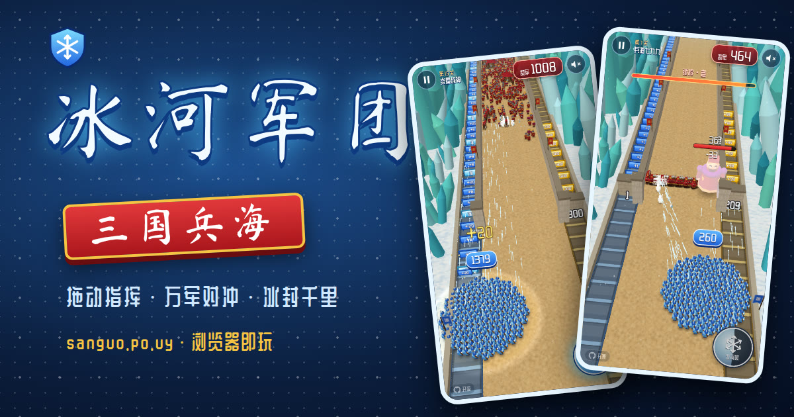

# 冰河军团：三国兵海

> 原创三国题材「兵海对冲」闯关网页小游戏。拖动指挥你的冰甲弓手军团，收集兵牌壮大兵力，射穿石墙、冰封敌将，击退成百上千的敌军。

**▶ 立即游玩：<https://sanguo.po.uy>**（备用：<https://sanguo-ice-legion.pages.dev>）

免安装，手机竖屏体验最佳，电脑浏览器同样可玩（居中竖屏视口）。



## 玩法

- **拖动指挥**：按住屏幕左右拖动，整个军团跟随移动；弓手会自动朝前方放箭。
- **兵道兵牌**：左侧传送带源源不断送来 `+1`、`+5`、冰晶等兵牌，走过去就能收入麾下；小心混在其中的负数陷阱。
- **石墙宝库**：右侧兵道被石墙封住，墙后藏着 `+99`、`+300` 等大额兵牌。站到墙前把它射穿——但别贪太久，敌军正在压境。
- **抉择之门**：中路升起左右两扇门（`×2` / `-20` …），只能选一边；带准星的门还能用箭射来改写数字。
- **冰河破**：冷却完毕后点击右下角冰晶按钮（或空格键），一道寒冰巨浪冻碎前方敌军，还能冰封敌将 3 秒。
- **敌将**：锤将砸地（红圈）、枪将突刺（红色长条）、火将投火（落点红圈）、终极 Boss 炎魔战神会砸地、投火、召唤铁骑并在半血后狂暴。看到预警立刻横移闪避！
- **兵力即生命**：敌兵撞进军团会一换一同归于尽，冲车更会碾碎一大片。兵力归零即「失败」。

## 特色

- 15 个精心设计的关卡，分五章逐步引入：盾兵、骑兵、弓手、冲车、抉择之门、四种敌将与最终 Boss；另有越战越强的**无尽模式**。
- 每关按存活兵力评 1～3 星；通关、斩将、斩敌获得金币，可在「强化军团」中永久升级：初始兵力、冰箭伤害、射速、冰河破冷却与距离。
- 进度、星级、金币、升级与静音设置保存在本地（localStorage）。
- 成百上千的单位同屏（InstancedMesh），目标在手机上 60 帧；帧率不足时自动降低渲染分辨率。
- 打击感：屏幕震动、受击闪白、冰碎粒子、冰刺、浮动数字、斩将慢动作；WebAudio 实时合成音效与背景音乐，可一键静音。
- 所有美术均为程序化生成的原创低多边形模型与贴图，无任何外部素材。

## 操作

| 操作 | 手机 | 电脑 |
| --- | --- | --- |
| 移动军团 | 按住拖动 | 鼠标拖动 / `←` `→` / `A` `D` |
| 冰河破 | 点右下角冰晶按钮 | `空格` 或 `F` |
| 暂停 | 左上角暂停键 | `Esc` / `P` |
| 结算后继续 | 点按钮 | `Enter` |

## 技术

- [Vite](https://vite.dev) + TypeScript + [three.js](https://threejs.org)，零运行时依赖之外的框架。
- `src/game/` 纯逻辑模拟（固定 60Hz 步长、网格空间划分、可复现的随机种子），与渲染完全解耦；`src/game/bot.ts` 是启发式自动玩家，用于菜单背景演示与关卡平衡模拟。
- `src/render/` three.js 渲染：实例化网格、合批的低多边形模型、Canvas 生成的贴图与文字牌、粒子与预警圈。
- `src/audio/` WebAudio 程序化音效与音乐；`src/ui/` 原生 DOM 界面。
- 字体：站酷庆科黄油体、马善政楷书（SIL OFL），经子集化仅保留游戏用到的字符。

## 开发

```bash
npm install
npm run dev       # 本地开发服务器
npm run build     # 类型检查 + 生产构建，输出到 dist/
npm run preview   # 预览生产构建
npm run sim       # 无头平衡模拟：npm run sim -- <关卡号|all> [升级等级] [局数] [技巧]
```

调试：访问 `/?debug` 后可在控制台使用 `__sgil.start(7)`、`__sgil.auto(true)`、`__sgil.ff(30)` 等测试钩子。

部署：推送到 `main` 后由 Cloudflare Pages 自动执行 `npm ci && npm run build` 并发布 `dist/`。

---

## English

**Ice Legion: Sea of Soldiers** is an original, free browser game inspired by Three Kingdoms "crowd battle" ads. Drag left/right to steer your crowd of ice archers, which fire automatically. Collect `+N` / `×N` panels from the side conveyors, shoot open walled lanes for big bonuses, pick the right lane-choice gate, unleash the Frost Blast to shatter whole regiments and freeze bosses, and survive hordes of hundreds to thousands of enemies led by generals with telegraphed attacks.

- Play: <https://sanguo.po.uy>
- 15 levels across 5 chapters + endless mode, 1–3 stars per level, coins and 5 permanent upgrades, progress saved in localStorage.
- Controls: touch/mouse drag or `←`/`→`/`A`/`D` to move, `Space`/`F` for Frost Blast, `Esc` to pause.
- Tech: Vite + TypeScript + three.js (InstancedMesh crowds), WebAudio synthesized sound, all art procedural. `npm install && npm run dev` to hack on it.

Source: <https://github.com/BetterAndBetterII/sanguo-ice-legion>
